<h2 align="center">
    <br>
    <p align="center" style="color: #D30404; font-weight: bold;">🚀 Projeto Landing Page - F4Bank
<p>
</h2>

<h3>Resumo </h3>

A proposta foi de criar uma landing page sobre uma empresa fictícia. Escolhemos a F4bank que é um projeto de um grande banco público brasileiro para competir com as startups que tem surgido, como Nubank, Banco Inter e Banco Neon, reforçando a segurança de um banco tradicional com décadas de história no país. 
 
<h2>
    <br>
    <p style="color: #D30404; font-weight: bold;">🎨 Layout</p>
</h2>

## Web

<p align="center" style="display: flex; align-items: flex-start; justify-content: center;">
     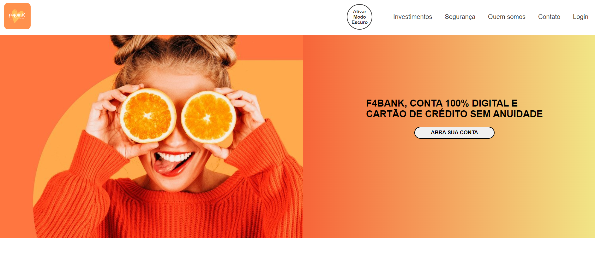
     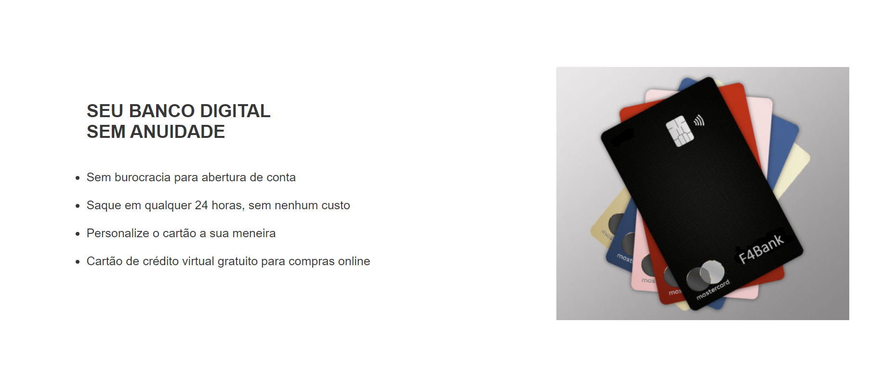
<p align="center" style="display: flex; align-items: flex-start; justify-content: center;">
     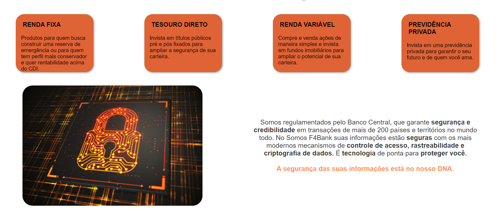
     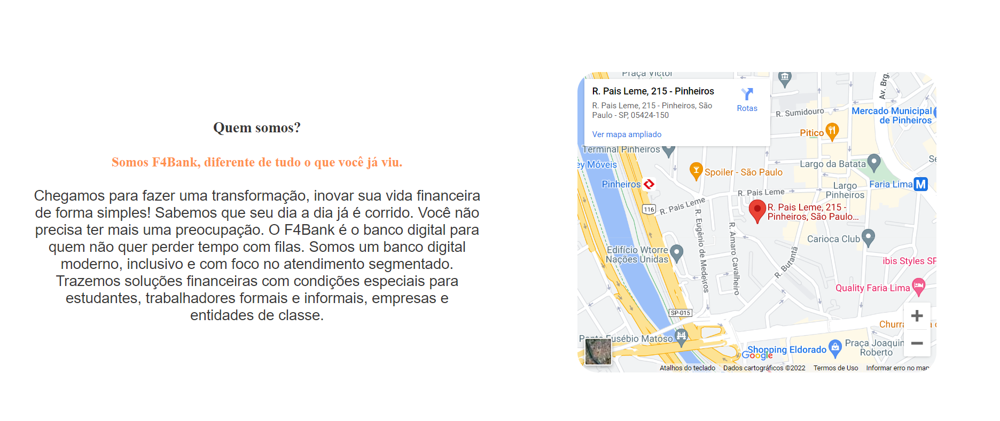
<p align="center" style="display: flex; align-items: flex-start; justify-content: center;">
     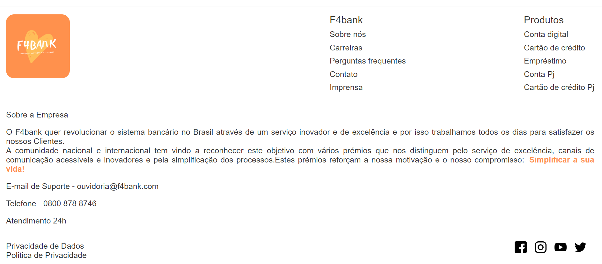
     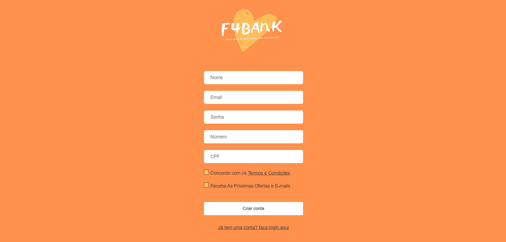

## Mobile

<p align="center">
     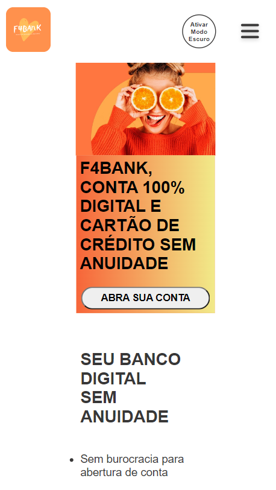
     
     
     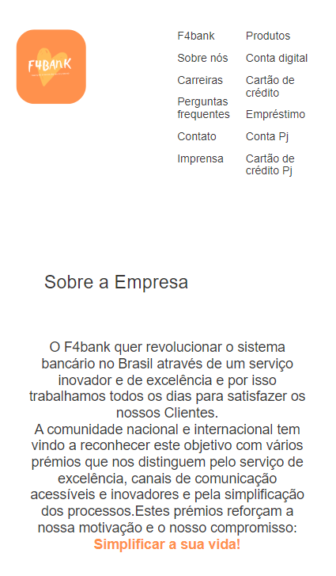
     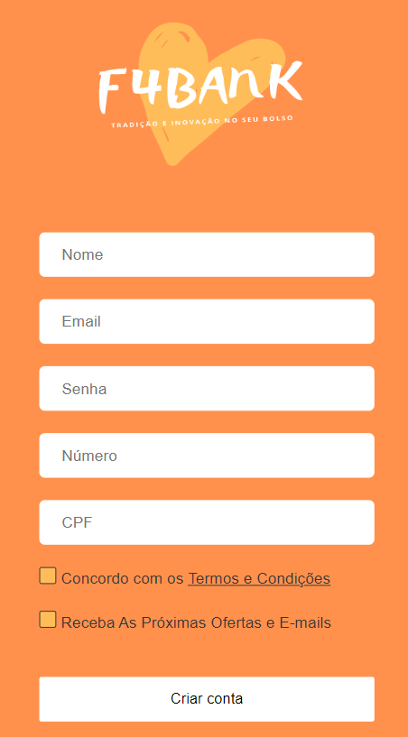

</p>
</p>

## 🔧 Estrutura 

### Header:
No mobile escondemos o menu e acionamos um menu vertical através de um botão tipo "hamburger":
<br>
<br>
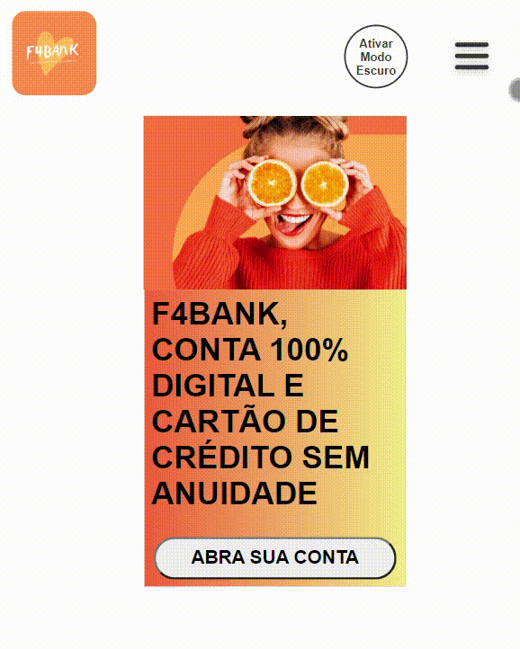

### Footer:
No footer usamos o hover para mudar a cor das redes sociais, todos os links externos são funcionais e abrem em uma nova página.
<br>
<br>
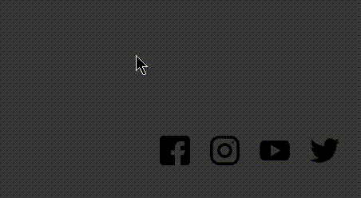

## Extras: 

<h3>Adicionado tema escuro acionado por botão.</h3>
<br>
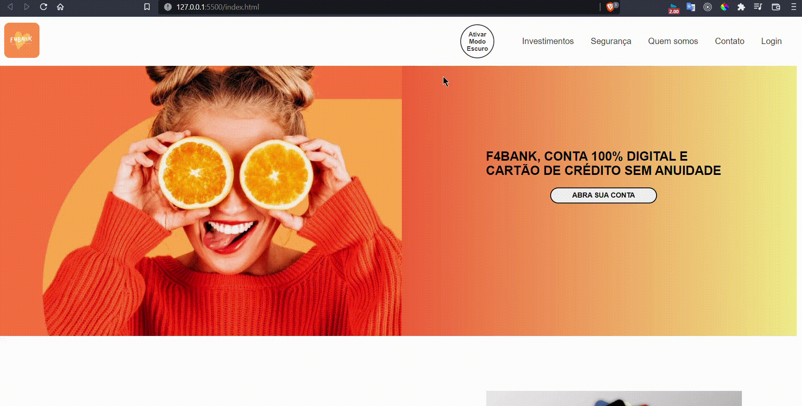
<h3>Botão abra sua conta funcional abrindo em uma nova pagina.</h3>
<br>
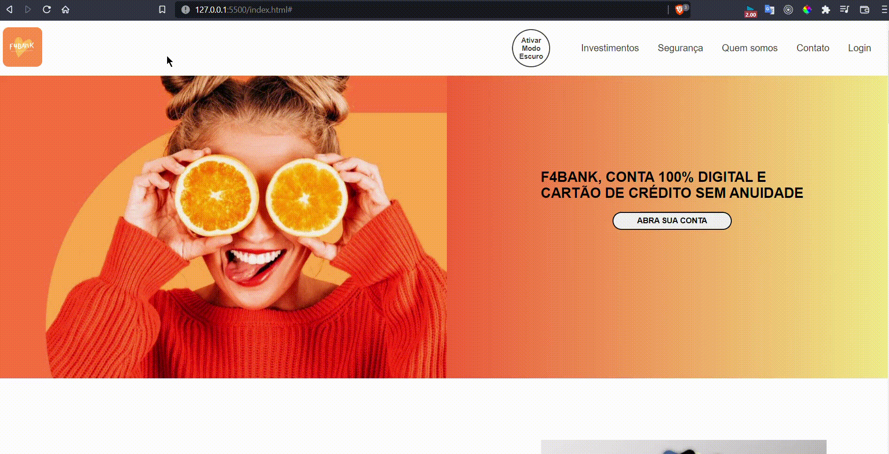

<h2>
    <br>
    <p style="color: #D30404; font-weight: bold;">🔗 Link do projeto no Surge</p>
</h2>

 http://projetof4bank.surge.sh/


<h2>
    <br>
    <p style="color: #D30404; font-weight: bold;">🔗 Link do Kanban</p>
</h2>

https://trello.com/b/JnhQ4bMz/landing-page

<br>

## 🛠️ Construído com

<p>

<!-- git -->

<!-- html -->

<!-- css -->

<!-- javascript -->
</p>


<h2>
    <br>
    <p style="color: #D30404; font-weight: bold;">📁 Arquitetura</p>
</h2>

```
- 📁 F4Bank
 |- 📁 css
 |  - 📑 arquivos css
 |  
 |- 📁 img
 |  - 📑 imagens do projeto
 |  - 📁 social
 |      - 📑 mídias sociais
 |  - 📁 img_readme
 |      - 📑 gifs e imagens da readme
 |      
 |- 📁 js
 |  - 📑 script.js
 |
 |- 📑 index.html
 |- 📑 login.html
 |- 📑 README.md
```
<h2>
    <br>
    <p style="color: #D30404; font-weight: bold;">👨‍💻 Grupo do Projeto</p>
</h2>

<table>
  <tr>
    <td align="center"><a href="https://github.com/gans92"><br /><sub><b>Gabriel Alisson</b></sub></a><br /></td>    
    <td align="center"><a href="https://github.com/SantiagoOliveira22"><br /><sub><b>Santiago Oliveira</b></sub></a><br /></td> 
    <td align="center"><a href="https://github.com/ju-marques"><br /><sub><b>Julia Marques</b></sub></a><br /></td> 
  </tr>
</table>

<br>
